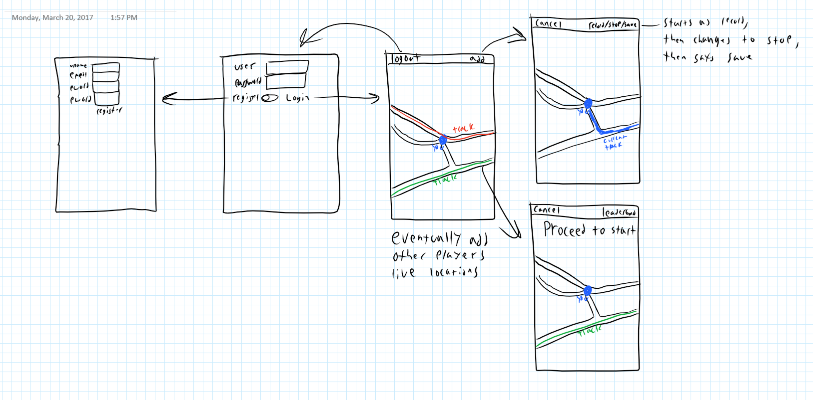

<html><body class="c12">
Jack Boyce

Proposal

Basic Description

My project is an IOS app that can track you while you complete courses and compete for the fastest time. You will be able to download courses made by other users as well as create and submit your own. Each course will have a leaderboard sorted by the fastest times first. I will need to learn how to use Apple&#39;s location services. I will also need to learn how to setup a simple database that can be used for saving the tracks generate by the app. I will program the app in swift and will use PHP and MySQL to create the database.

Resources
<ul class="c4 lst-kix_91pss0g6s6p8-0 start"><li class="c6">Stack Overflow</li><li class="c6">Apple Swift 3 API</li><li class="c6">Laravel Videos (<a class="c10" href="https://www.google.com/url?q=https://laracasts.com&amp;sa=D&amp;ust=1490037819819000&amp;usg=AFQjCNHHVcSBNzcfh404joQKZUj4Y55F-g">https://laracasts.com</a>&nbsp;for learning how to complete the webserver and backend)</li><li class="c6">Chris Jerrett (for database help)</li><li class="c6"><a class="c10" href="https://www.google.com/url?q=http://www.raywenderlich.com&amp;sa=D&amp;ust=1490037819821000&amp;usg=AFQjCNG2rNlm1RCnUV_GO87-Eg5XtxaCGQ">www.raywenderlich.com</a>&nbsp;(For learning swift location and mapping)</li></ul><ul class="c4 lst-kix_91pss0g6s6p8-1 start"><li class="c1"><a class="c10" href="https://www.google.com/url?q=https://www.raywenderlich.com/87008/overlay-views-mapkit-swift-tutorial&amp;sa=D&amp;ust=1490037819822000&amp;usg=AFQjCNEnJI3Y933vWTgMXW5zMkYx_ocGMg">https://www.raywenderlich.com/87008/overlay-views-mapkit-swift-tutorial</a>&nbsp;For drawing the array of locations to a map view.</li><li class="c1"><a class="c10" href="https://www.google.com/url?q=https://www.raywenderlich.com/97944/make-app-like-runkeeper-swift-part-1&amp;sa=D&amp;ust=1490037819823000&amp;usg=AFQjCNFeQzchEJmi-S2cOA8umidf_YYjLA">https://www.raywenderlich.com/97944/make-app-like-runkeeper-swift-part-1</a>&nbsp;For getting an array of locations.</li></ul>
Tentative Schedule
<ul class="c4 lst-kix_pmi0hy3ycztd-0 start"><li class="c6">Feb 3: Storyboard for app completed</li><li class="c6">May 5: Done</li></ul>

Future Layout Plan 
</body></html>
